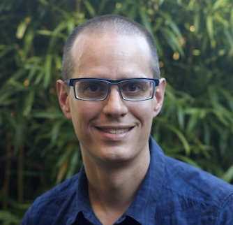

<h1 id="greeting">Hi! 👋🏼 I'm Brent.</h1>

I'm a software engineer based in Portland, Oregon that specializes in Ruby on Rails with a double-minor in frontend development and agile processes/organizational design. I believe that boring tech is good tech, and that we must build software for real users, taking their needs and foibles into account.

<h2>Ruby on Rails is just the best</h2>

I have been working in <a href="https://rubyonrails.org/">Rails</a> since 2005, when Rails was at v0.9.7. It's come a long way. It's not perfect by any means &mdash; no framework is &mdash; but it's still the best thing I've seen for rapid iteration on a web app. The minimal boilerplate along with the expressiveness of Ruby make it a pleasure to work in.

With the recent addition of the <a href="https://hotwired.dev/">Hotwire</a> stack, in particular <a href="https://stimulus.hotwired.dev/">Stimulus</a> and its bestie <a href="https://docs.stimulusreflex.com/">StimulusReflex</a>, building a web app with server-side rendering and a reactive pattern is a breeze.

<h2>Where I want to be</h2>

I'm excited about working for a company that's trying to make the world a better place: climate tech, healthcare and science are three sectors I'm interested in. But, a brief warning about AI &mdash; if you say you're using AI then you probably can't be doing good things for the environment. AI consumes energy like it's going out of style.

My ideal role is at the senior or lead level, where I can not only contribute technically but also work on some of the more human and process parts of the team. I have extensive process design and facilitation experience, and it's work that I find profoundly satisfying.

<h2>Todo:</h2>

<ol>
  <li><a href="https://www.bridgetownrb.com/docs/deployment#github-pages">publish to gh pages</a></li>
</ol>
